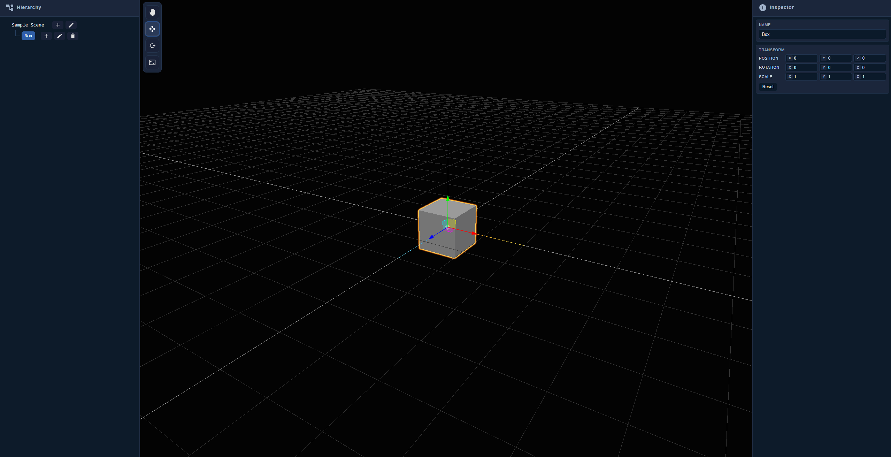

# Model Tree + 3D View

A single-page **TypeScript React** app that lets you build a model hierarchy (tree) and edit it in a **Three.js** viewport. Nodes can be empty groups or primitives (Box, Cylinder, Cone, Sphere). You can reorder via drag-and-drop, select from either the tree or the 3D view, and manipulate transforms with a gizmo.

<p align="center">
  
</p>

---

## Demo (what to try)

- **Add nodes:** Hover a row, click the ➕ icon, then pick a primitive or “Empty”.
- **Delete nodes:** Hover a row and click the 🗑 icon to delete a node (and its subtree).
- **Rename nodes:** Select a row and click ✏️ to edit the node name.
- **Reorder nodes:** Drag a row; drop on the **top/bottom** band to move among siblings or on the **middle** to reparent under the target.
- **Select in 3D:** Click any mesh in the viewport to select its node.
- **Manipulate:** Use the toolbar (or hotkeys below) to **Move / Rotate / Scale** the selected node.
- **Inspector:** Edit **Position / Rotation / Scale** numerically. **Reset** returns TRS to defaults.
- **Zoom to node:** Double-click a row in the tree.
- **Autosave:** Scene is saved to LocalStorage after edits (500 ms debounce). Refresh to restore.

### Hotkeys
- **Q**: View/hand (hide gizmo, pan/rotate with mouse)
- **W**: Move
- **E**: Rotate
- **R**: Scale

---

## Tech stack

- **React + TypeScript**
- **Three.js** (OrbitControls, TransformControls, post-processing OutlinePass)
- **Vite**
- **CSS Modules**
- **LocalStorage** for lightweight persistence

---

## Getting started

> All commands below run inside **`frontend/`**.

### Prerequisites
- Node **18+** (LTS recommended)
- npm or pnpm (commands use npm)

### Install
```bash
cd frontend
npm install
```

### Run
```bash
npm run dev
```

### Build & local preview
```bash
npm run build
npm run preview
```

Open the printed URL (typically http://localhost:5173)

## Testing

There’s a small script to exercise the pure “model” functions (create, add, update, delete, reparent, reorder) without the UI:

File: frontend/src/tests/treeTest.ts

```bash
cd frontend
npx tsx src/tests/treeTest.ts
```
